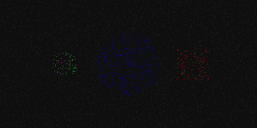
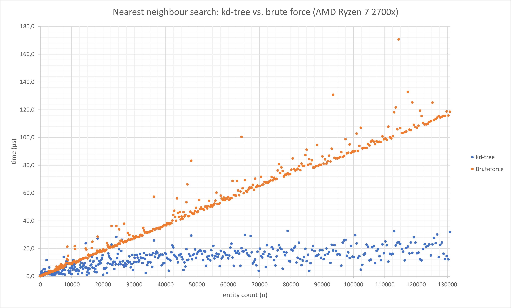
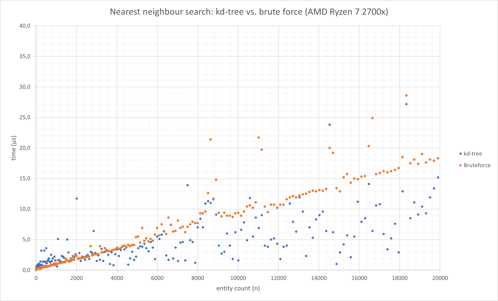

# BRIEF - Broad Radius Integrated Entity Finder

> A fancy name for a simple [kd-tree](https://en.wikipedia.org/wiki/K-d_tree) experiment. Not recommended to use as a library or whatever as it is just a naive implementation.

Visualization of 'kdtree_nearest_n', 'kdtree_nearest_radius' and 'kdtree_nearest_aabb':

> The kd-tree uses three dimensions but only two are visible in this visualization (x&z).

Measurement of 'kdtree_nearest' vs. simple brute-force loop:

Measurement of 'kdtree_nearest' vs. simple brute-force loop (zoomed in on 0-20000):

See [docs/performance_graphs.xlsx](docs/performance_graphs.xlsx) for the raw measured data...
